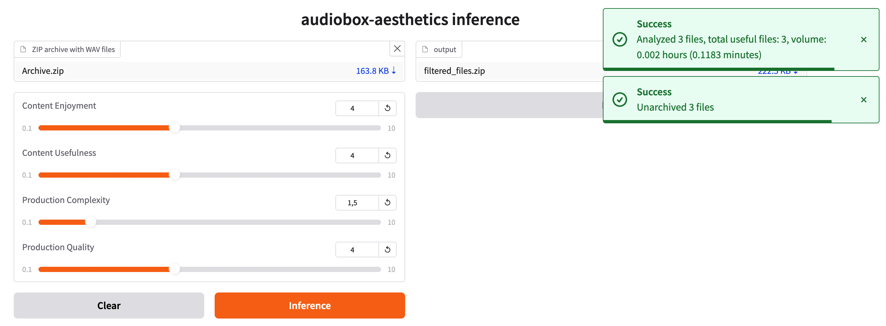

# Audiobox Aesthetics inference

[](https://github.com/egorsmkv/audiobox-aesthetics-inference/actions/workflows/ci.yml)



## Install

```bash
uv venv --python 3.12

source .venv/bin/activate

uv pip install -r requirements.txt
uv pip install -r requirements-dev.txt
```

## Run

```bash
gradio app.py
```
